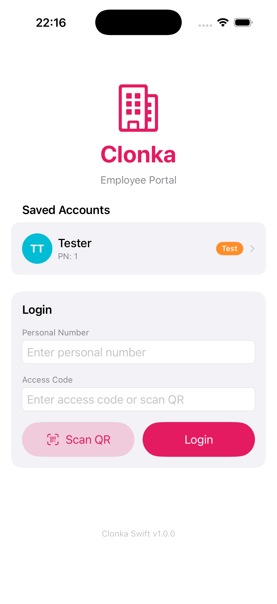
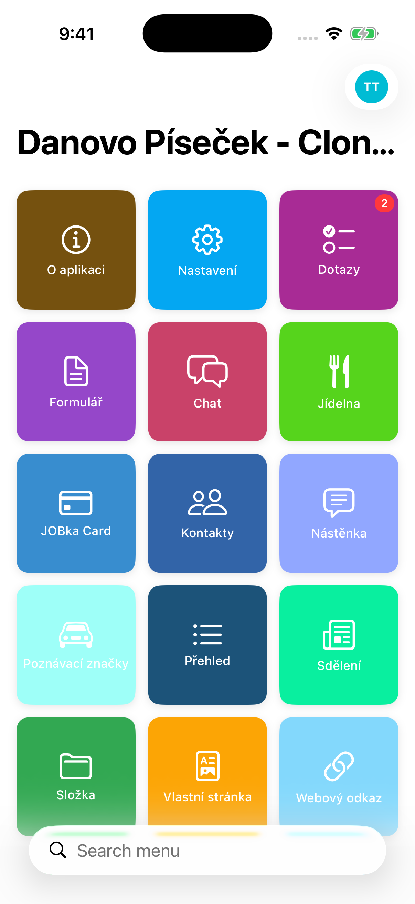
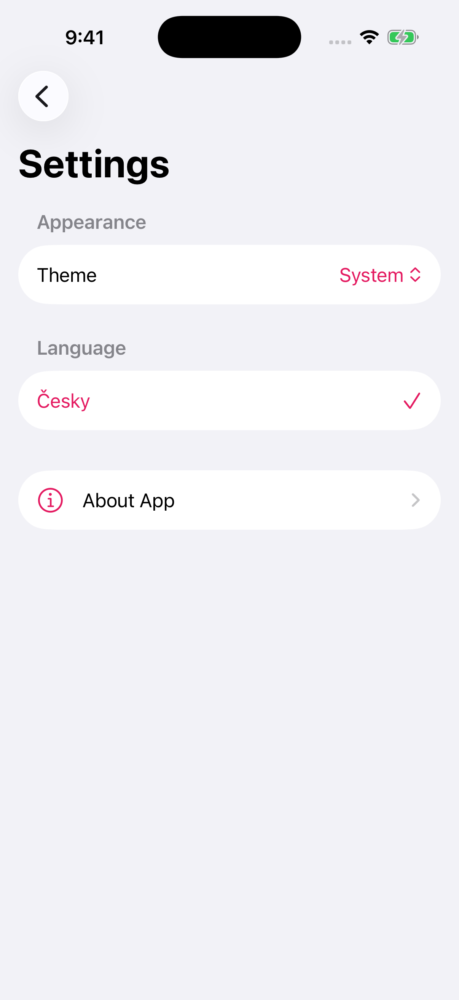
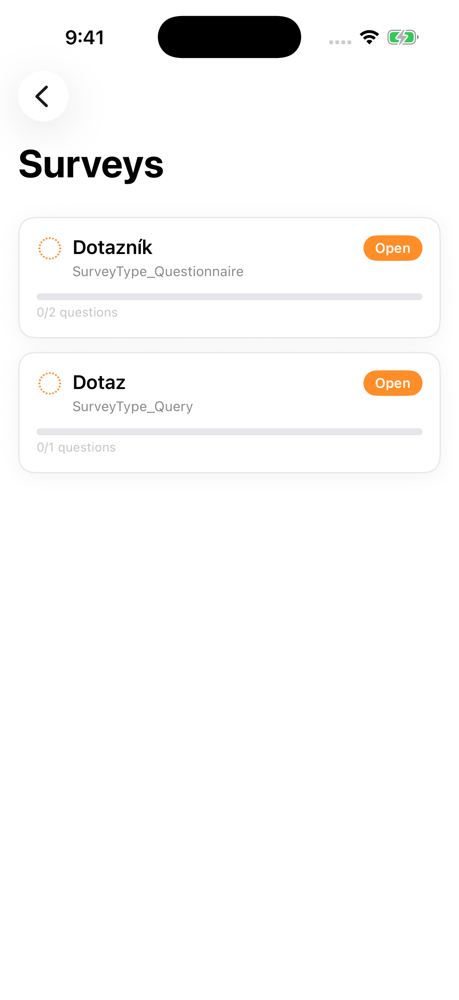
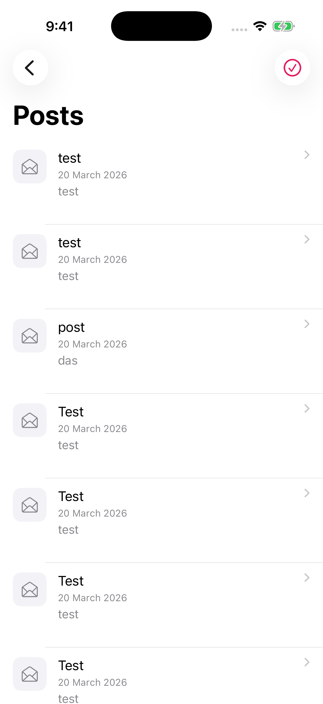
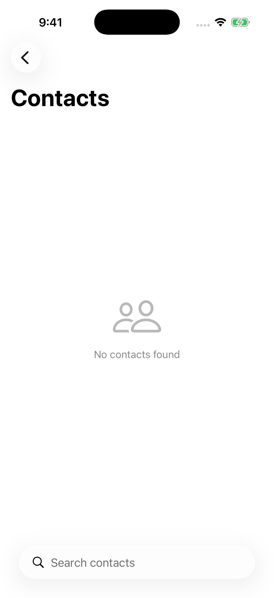
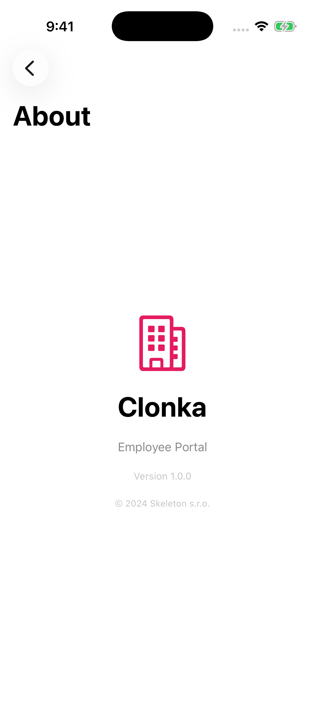
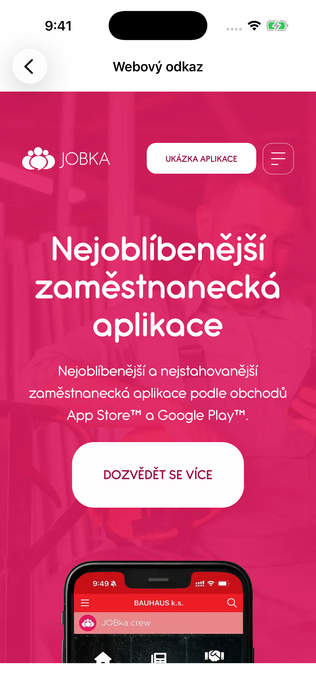

# Clonka Swift

Native iOS employee portal app built with **SwiftUI** — replacement for the MAUI-based Jobka app.

## Screenshots

| Login | Menu | Settings | Surveys | Posts |
|:-----:|:----:|:--------:|:-------:|:-----:|
|  |  |  |  |  |

| Chat | Contacts | About | Webview |
|:----:|:--------:|:-----:|:-------:|
|  |  |  |  |

## Features

- **Login & Session** — PIN/password auth with saved profiles
- **Posts** — company news feed with read receipts and approvals
- **Surveys** — V1 + V2 survey support
- **Messages** — internal messaging / chat
- **Contacts** — company directory
- **Canteen** — cafeteria menu
- **Profile & Settings** — employee profile, app preferences
- **Trust Box** — anonymous feedback
- **Stream** — activity feed
- **Television** — company TV/media
- **License Plate** — vehicle registration
- **Card** — digital employee card
- **Custom Pages** — dynamic company content (webview)
- **Data Lists** — configurable data views with forms
- **Error Reporting** — in-app developer tools

## Tech Stack

- Swift 5.9+, SwiftUI
- Swift Concurrency (async/await)
- URLSession (networking)
- OSLog (logging)
- Minimum deployment: iOS 17.0

## Prerequisites

- Xcode 16+ with Command Line Tools
- Apple Developer account (for device builds)
- Physical iOS device or Simulator

## Dev

Open the project in Xcode:

```bash
open ClonkaApp/ClonkaApp.xcodeproj
```

### iOS Simulator

1. Open the project in Xcode
2. Select a simulator (e.g. iPhone 17 Pro) from the device toolbar
3. Press **⌘R** to build and run

Or from the command line:

```bash
# Boot simulator
xcrun simctl boot "iPhone 17 Pro"

# Build and run
xcodebuild -project ClonkaApp/ClonkaApp.xcodeproj \
  -scheme ClonkaApp \
  -destination 'platform=iOS Simulator,name=iPhone 17 Pro' \
  build

# Install and launch
xcrun simctl install "iPhone 17 Pro" \
  build/Build/Products/Debug-iphonesimulator/ClonkaApp.app
xcrun simctl launch "iPhone 17 Pro" cz.skeleton.clonka-swift
```

> Available simulators: `xcrun simctl list devices available`

### iOS Physical Device

The device must be paired, trusted, and registered in your Apple Developer account.

```bash
xcrun devicectl list devices
```

1. Open `ClonkaApp/ClonkaApp.xcodeproj` in Xcode
2. Select your device from the device toolbar
3. Press **⌘R** to build and run

## Build

### Archive & Export (Xcode)

1. **Product → Archive** in Xcode
2. In the Organizer, select the archive → **Distribute App**
3. Choose **Development** or **Ad Hoc** distribution
4. Export the `.ipa`

### Archive (Command Line)

```bash
# Archive
xcodebuild archive \
  -project ClonkaApp/ClonkaApp.xcodeproj \
  -scheme ClonkaApp \
  -archivePath build/ClonkaApp.xcarchive \
  -destination 'generic/platform=iOS'

# Export IPA (requires ExportOptions.plist)
xcodebuild -exportArchive \
  -archivePath build/ClonkaApp.xcarchive \
  -exportPath build/ \
  -exportOptionsPlist ExportOptions.plist
```

### Install on Device

```bash
# Find your device UUID
xcrun devicectl list devices

# Install
xcrun devicectl device install app \
  --device <DEVICE-UUID> \
  build/ClonkaApp.ipa
```

## Hot Reload

A helper script is included for rapid iteration:

```bash
./hot-reload.sh
```

## Project Structure

```
ClonkaApp/
├── ClonkaApp/
│   ├── App/          # Entry point, AppState, SessionManager, RootView
│   ├── UI/           # SwiftUI Views + ViewModels (per module)
│   ├── Data/         # API services, models, interceptors
│   ├── Domain/       # Repository protocols, business models
│   └── Util/         # AppResult, AppLogger, ConfigManager
├── ClonkaAppTests/   # Unit tests
└── ClonkaApp.xcodeproj
```
